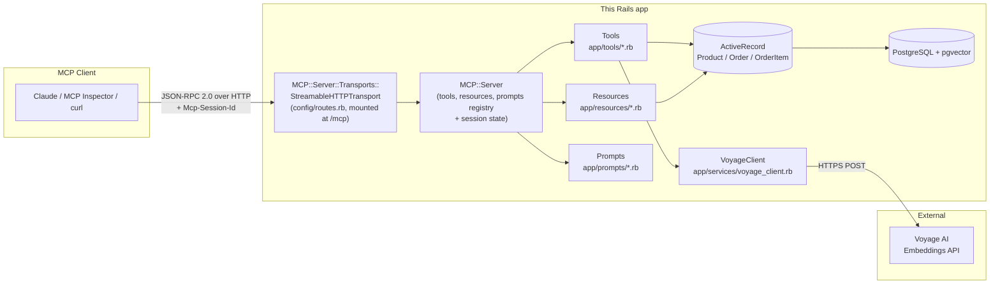
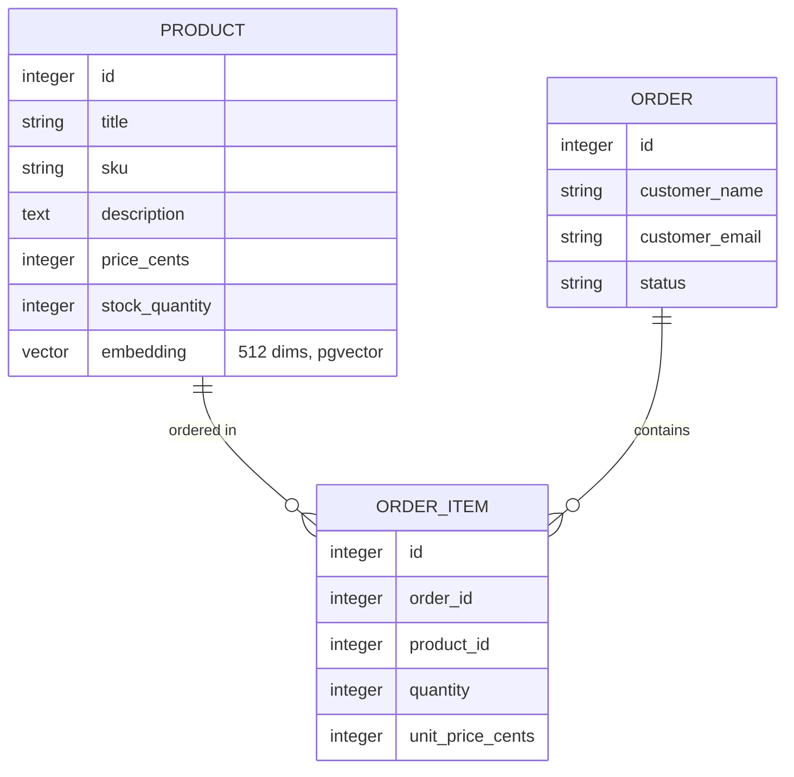

# Shop MCP Server

A Ruby on Rails app that exposes a small e-commerce store — products,
orders, inventory, and semantic search — to LLMs like Claude over the
**Model Context Protocol (MCP)**, using the [official `mcp` Ruby SDK](https://github.com/modelcontextprotocol/ruby-sdk).

Built as a learning project: to understand how MCP servers actually work,
end to end, in a Rails app — not just to wire up a tutorial, but to hit
real bugs, read the protocol spec directly, and verify every claim
against actual running code rather than assuming the docs are right.

> **Note on naming:** this project uses the **official `mcp` gem** by
> `modelcontextprotocol` (`ruby.sdk.modelcontextprotocol.io`). It
> previously used a different gem, **`fast-mcp`** by `yjacquin` — a
> separate, unrelated project despite the similar name. See
> [Why we migrated](#why-we-migrated-from-fast-mcp) below. Also unrelated:
> **FastMCP**, a popular *Python* framework with an even more similar
> name — if you're searching for help online, make sure you're reading
> docs for the right one.

## What is MCP, and what does this app do?

Normally, an AI assistant can only talk. It has no hands — it can't check
your real database, place a real order, or know what's actually in stock.
It can only guess based on what you tell it in the conversation.

**MCP gives the AI hands.** This app is a small toolbox a compatible AI
client (Claude, an IDE assistant, etc.) is allowed to use. Each tool is
one specific capability, labeled clearly enough that the AI can decide on
its own when to use it — nothing is hardcoded about *when* a tool gets
called; the AI reads each tool's description and reasons about it.

Concretely, when someone asks an assistant *"what's running low on
stock?"*:

1. The client asks this server what tools exist (`tools/list`).
2. The AI reads each tool's description and decides `CheckInventoryTool`
   matches the question — nobody hardcoded that decision.
3. The client calls the tool (`tools/call`) with whatever arguments make
   sense.
4. This Rails app runs real Ruby code against a real PostgreSQL database
   and returns real numbers.
5. The AI turns that real data into a normal sentence back to the user.

Without step 3–4, the AI would just be making up a plausible-sounding
answer. That's the entire point of everything below.

A newer tool, `semantic_search_products_tool`, extends this further:
instead of exact-match lookups, it lets the AI find products by
*meaning* — "something warm for winter" correctly surfaces a scarf and
beanie even though neither word appears in their descriptions. See
[Semantic Search (RAG)](#semantic-search-rag) below.

## Architecture



The MCP layer (tools/resources/prompts) never touches the database
directly except through plain ActiveRecord calls — a tool's `call` method
looks exactly like a Rails controller action querying a model. The
protocol machinery (sessions, JSON-RPC framing, schema shape) is entirely
the gem's responsibility; this app's own code is just Ruby and
ActiveRecord underneath it. The one exception is `SemanticSearchProductsTool`,
which also calls out to Voyage AI's embeddings API via a small internal
HTTP client (`VoyageClient`) before querying Postgres.

## Data model



Money is stored as integer cents (`price_cents`, `unit_price_cents`) to
avoid floating-point rounding issues. `unit_price_cents` is copied onto
`OrderItem` at order time rather than always reading the live
`Product` price — an order should keep showing what the customer
actually paid, even if the product's price changes later.

## Tools

| Tool | Type | What it does |
|---|---|---|
| `get_product_tool` | read-only | Full detail for one product, by ID or SKU |
| `list_products_tool` | read-only | Search/browse the catalog, optionally filtered to in-stock items |
| `check_inventory_tool` | read-only | Flags every product at or below a stock threshold (default 5) |
| `list_orders_tool` | read-only | Recent orders, optionally filtered by status |
| `get_order_tool` | read-only | Full order detail including line items |
| `create_order_tool` | **write** | Places a new order and decrements stock — annotated `destructive_hint: true` |
| `semantic_search_products_tool` | read-only | Finds products by meaning, not exact keywords, using Voyage AI embeddings + pgvector cosine similarity |

Every tool declares [MCP annotations](https://ruby.sdk.modelcontextprotocol.io/server/tools/)
(`read_only_hint`, `destructive_hint`, `idempotent_hint`, `open_world_hint`).
A compliant client uses these to decide what's safe to call automatically
versus what needs the user's OK first — in Claude, this is genuinely
visible: the six read-only tools are grouped separately from
`create_order_tool`, which is flagged for approval.

`create_order_tool` wraps its work in a single `ActiveRecord::Base.transaction`
— if any line item fails (bad SKU, insufficient stock), the entire order
and every stock decrement inside it is rolled back, not just the failing
line. Verified directly: a mixed valid/invalid order leaves `Order.count`
and stock levels completely unchanged.

## Semantic Search (RAG)

`semantic_search_products_tool` is a small [retrieval-augmented
generation](https://en.wikipedia.org/wiki/Retrieval-augmented_generation)
(RAG) feature layered on top of the same `products` table the other
tools use — it adds *how data is found*, not new data.

**How it works:**

1. Every product's `title` + `description` is sent to
   [Voyage AI](https://www.voyageai.com/)'s embeddings API
   (`voyage-3.5-lite`, 512 dimensions) via `VoyageClient`
   (`app/services/voyage_client.rb`), a small `Net::HTTP` wrapper with no
   external HTTP gem dependency.
2. The resulting vector — 512 numbers representing the text's *meaning*
   — is stored in a `vector(512)` column on `products`, via the
   [pgvector](https://github.com/pgvector/pgvector) Postgres extension
   and the [`neighbor`](https://github.com/ankane/neighbor) gem
   (`has_neighbors :embedding` on `Product`).
3. At search time, the query string is embedded the same way, and
   `Product.nearest_neighbors(:embedding, query_vector, distance: "cosine")`
   asks Postgres which stored vectors are closest — plain geometry, no
   AI involved at this step.
4. The matched products are returned to the calling AI client (e.g.
   Claude), which reasons about them and writes the actual answer — the
   "generation" half of RAG. This app only ever does the "retrieval"
   half; it never generates text itself.

**Backfilling embeddings** for existing products:

```bash
bin/rails embeddings:backfill
```

Only embeds products where `embedding` is `nil`, and sends every
missing product in a **single batched API call** rather than one call
per product — Voyage's rate limit on the free tier is as low as 3
requests/minute, so batching isn't an optimization here, it's a
requirement.

**Setup:** requires a `VOYAGE_API_KEY` in `.env` — see
[`.env.example`](.env.example). Note that a key generated through
MongoDB Atlas's "Model API Key" flow authenticates against
`ai.mongodb.com`, not `api.voyageai.com` — the two are not
interchangeable; `VoyageClient::ENDPOINT` is set for the Atlas-issued
key path.

**Why Voyage specifically:** [Anthropic's own docs state Anthropic does
not offer its own embedding model](https://platform.claude.com/docs/en/build-with-claude/embeddings)
and recommend Voyage AI as an embeddings partner for Claude-based RAG —
this project follows that recommendation rather than picking an
arbitrary provider.

## Resources

| Resource | URI | Content |
|---|---|---|
| Product Catalog | `shop://products/catalog` | Full catalog as JSON |
| Low Stock Products | `shop://products/low-stock` | Products at or below 5 units |

A **resource** is data a client can read directly, like opening a file —
no arguments, no logic branches. Useful for context a client might want
to keep around throughout a conversation, rather than query on demand
the way a tool is queried.

## Prompts

| Prompt | Argument | What it does |
|---|---|---|
| `inventory_check` | `threshold` (optional) | Hands the client a ready-made question: *"what's at or below N units, and what should I reorder?"* |

A **prompt** is different from both of the above: it's a saved,
user-invokable template. It doesn't call a tool itself — it just phrases
a good question, which the client's LLM then answers, likely by calling
`check_inventory_tool` on its own.

Tools, resources, and prompts are the three core building blocks MCP
defines. This project uses all three.

## Setup

Requires Ruby 3.2+ (this project runs on Ruby 4.0.4), Bundler, and
**PostgreSQL 13+ with the [pgvector](https://github.com/pgvector/pgvector)
extension installed** (e.g. `postgresql-16-pgvector` on Ubuntu — the
exact package name depends on which Postgres major version you're
running).

```bash
git clone <this-repo>
cd shop_mcp_server
bundle install
cp .env.example .env   # then fill in VOYAGE_API_KEY
bin/rails db:create db:migrate
bin/rails db:seed
bin/rails embeddings:backfill   # populate embeddings for semantic search
bin/rails server
```

The MCP server is live at `http://localhost:3000/mcp` — a single
endpoint, handling the full JSON-RPC/Streamable HTTP protocol.

> **Note:** this project originally ran on SQLite (Rails 8's default)
> and migrated to PostgreSQL specifically to support pgvector, which
> has no SQLite equivalent for this gem stack. If you're adapting this
> project and don't need semantic search, SQLite works fine for the
> other six tools alone.

## Testing it yourself

### 1. Directly in Ruby (cheapest, no protocol involved)

```ruby
bin/rails runner 'pp GetProductTool.call(sku: "TOTE-001", server_context: {})'
```

This bypasses the gem's schema layer entirely — good for checking your
own business logic fast, but it does **not** prove argument validation
works. For that:

### 2. The real protocol, by hand with curl

MCP's Streamable HTTP transport is session-based. Three steps:

```bash
# 1. Initialize — returns an Mcp-Session-Id header
curl -s -D - -o /dev/null http://localhost:3000/mcp \
  -H "Accept: application/json, text/event-stream" \
  --json '{"jsonrpc":"2.0","id":1,"method":"initialize","params":{"protocolVersion":"2025-11-25","capabilities":{},"clientInfo":{"name":"curl","version":"1.0"}}}'

# 2. Acknowledge (a notification — no id, no reply body, just 202)
SESSION_ID=<paste the Mcp-Session-Id header value>
curl -s http://localhost:3000/mcp \
  -H "Accept: application/json, text/event-stream" \
  -H "Mcp-Session-Id: $SESSION_ID" \
  --json '{"jsonrpc":"2.0","method":"notifications/initialized"}'

# 3. Now the session is live — call a tool
curl -s http://localhost:3000/mcp \
  -H "Accept: application/json, text/event-stream" \
  -H "Mcp-Session-Id: $SESSION_ID" \
  --json '{"jsonrpc":"2.0","id":2,"method":"tools/call","params":{"name":"list_products_tool","arguments":{"in_stock_only":true}}}'
```

### 3. MCP Inspector

```bash
npx @modelcontextprotocol/inspector
```

Add a server with transport **Streamable HTTP** and URL
`http://localhost:3000/mcp`. Lists all tools/resources/prompts with
their schemas, and lets you call them by hand.

### 4. A real client (Claude)

For Claude Desktop or claude.ai to reach a local server, it connects from
**Anthropic's cloud infrastructure**, not your machine — `localhost`
won't work. Expose your local server first (e.g. with `ngrok http 3000`),
then add a custom connector pointing at
`https://<your-tunnel-url>/mcp`.

Two things worth knowing if you try this:

- This gem's DNS-rebinding protection (`allowed_hosts:`/`allowed_origins:`
  on `StreamableHTTPTransport.new`) only matches **exact strings**, not
  regular expressions — unlike Rails' own `config.hosts`, which does
  support regex. A free ngrok tunnel gets a new random subdomain each
  restart, so hardcoding it means updating this line each time; using
  `ENV.fetch("NGROK_HOST", nil)` instead avoids editing code for it.
  Note that `allowed_hosts` needs a **bare hostname** while
  `allowed_origins` needs the **full scheme + host** — the two HTTP
  headers they check (`Host` vs. `Origin`) are shaped differently, so
  `config/routes.rb` derives one from the other with `URI(...).host`
  rather than storing both separately.
- Sessions live in server memory (see [Known limitations](#known-limitations)
  below) — restarting the Rails server while a client is connected kills
  its session; it'll need to reconnect.

## Why we migrated from fast-mcp

This project originally used `fast-mcp`, a popular community gem with
excellent Rails ergonomics (a generator, auto-discovery of tools via
`ApplicationTool.descendants`). It only implements the **legacy SSE
transport** — two separate endpoints (a long-lived `GET` for server
push, a separate `POST` for client messages).

Claude's custom-connector setup probes assuming **Streamable HTTP** — a
single endpoint handling both directions. Against `fast-mcp`'s SSE-only
`/mcp/sse` route, that probe's `POST` request landed on a `GET`-only
endpoint and 405'd, which Claude's setup flow misreported as an
authentication problem. This is a real, currently-open, unresolved
limitation of `fast-mcp` (see its GitHub issues #166 and #168) — not a
configuration mistake.

The official `mcp` gem implements Streamable HTTP natively, so this
project migrated to it entirely: every tool, both resources, and the
mounting layer were rewritten. Full details of what changed and why are
in [`docs/mcp-concepts.md`](docs/mcp-concepts.md).

### The trade-off that came with the fix

The official gem's Rails integration offers two patterns:

- **Mount** (used here) — one `MCP::Server` + transport built once at
  boot, in `config/routes.rb`. Supports the full session lifecycle
  (what a production MCP server actually looks like), at the cost of
  `config.enable_reloading = false` — every code change needs a full
  server restart, not just new files.
- **Controller** (not used) — a plain `ActionController::API` action
  builds a fresh, stateless server per request. Normal Rails dev
  workflow, no restart cost, but no cross-request session state.

This project deliberately chose **mount**, specifically to learn the
fuller session-lifecycle architecture, accepting the slower dev loop as
the cost of that.

## Known limitations

- **Sessions are in-memory, single-process.** `StreamableHTTPTransport`
  stores session state in a plain Ruby `Hash` with no external/pluggable
  store. The gem's own docs confirm it must run as a single process —
  even multiple Puma *workers* on one machine break it, since forked
  processes don't share memory. This is **not a Rails-specific
  limitation** — the official Python and TypeScript MCP SDKs have the
  identical design, and it's serious enough that the newest MCP spec
  revision (2026-07-28) is moving toward a stateless model specifically
  to fix it.
- **No authentication.** `authenticate`/`auth_token` were never enabled;
  every caller is treated identically. Fine for local development, not
  for any real deployment.
- **No live push notifications.** MCP supports `resources/subscribe` for
  server-initiated updates (visible as a "Subscribe" button in
  Inspector); this project doesn't wire it up, so a client has to
  re-read a resource to see fresh data.
- **Schema validation is type-only.** Unlike `fast-mcp`'s `dry-schema`
  DSL, this gem's `input_schema` is plain JSON Schema with no automatic
  "must be present and non-empty" enforcement layered on top — tools
  defend against bad/missing input themselves, the same way they always
  defended against genuine business-logic errors.
- **Embeddings aren't kept in sync automatically.** Editing a product's
  title/description doesn't re-embed it — `bin/rails embeddings:backfill`
  only fills in products where `embedding` is `nil`. A real production
  version would re-embed on save (e.g. an `after_commit` callback).
- **Voyage AI's default data-use terms are opt-out, not opt-in.** By
  default, text sent to Voyage's API may be used to improve their
  models unless you explicitly opt out in their dashboard — worth
  checking before sending anything sensitive/proprietary through this
  pipeline.

## How it works — deeper notes

[`docs/mcp-concepts.md`](docs/mcp-concepts.md) has the full running log of
what this project actually verified while building it, not just what the
docs claim — including:

- The exact mechanism distinguishing a JSON-RPC *request* from a
  *notification* (one field: does it have an `id`)
- The full three-step Streamable HTTP handshake
- A tool's three separate names (`name`, `title`, `description`) and what
  each is actually for
- A documented discrepancy between the gem's own example code and its
  real runtime behavior for prompt arguments (found by adding a debug
  log line and checking, not by assuming the docs were right)

## Possible extensions

Known MCP capabilities not built here, in case you want to take this
further:

- **Resource subscriptions** — push updates when data changes, instead of
  polling
- **Sampling** — the server asking the *client's* LLM to generate
  something on its behalf
- **Elicitation** — a tool pausing mid-call to ask the user a follow-up
  question
- **OAuth-based authorization** — the real way a production MCP server
  would authenticate callers
- **Auto re-embedding** — keep `products.embedding` in sync via an
  `after_commit` callback instead of a manual rake task

## License

MIT — see [LICENSE](LICENSE).
