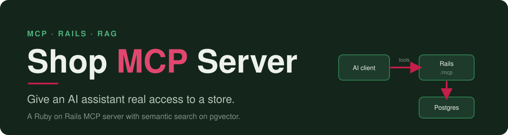
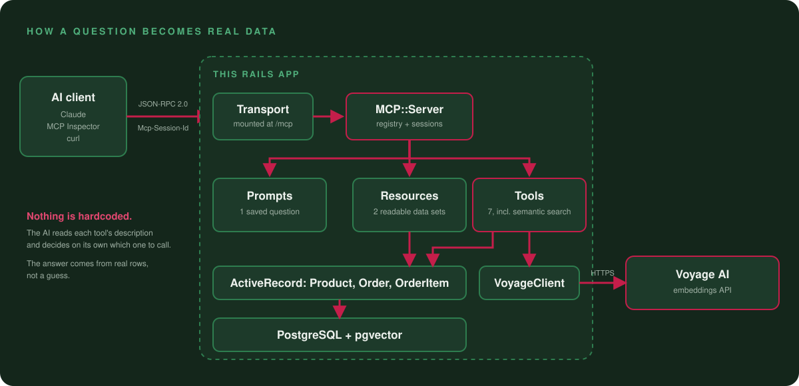
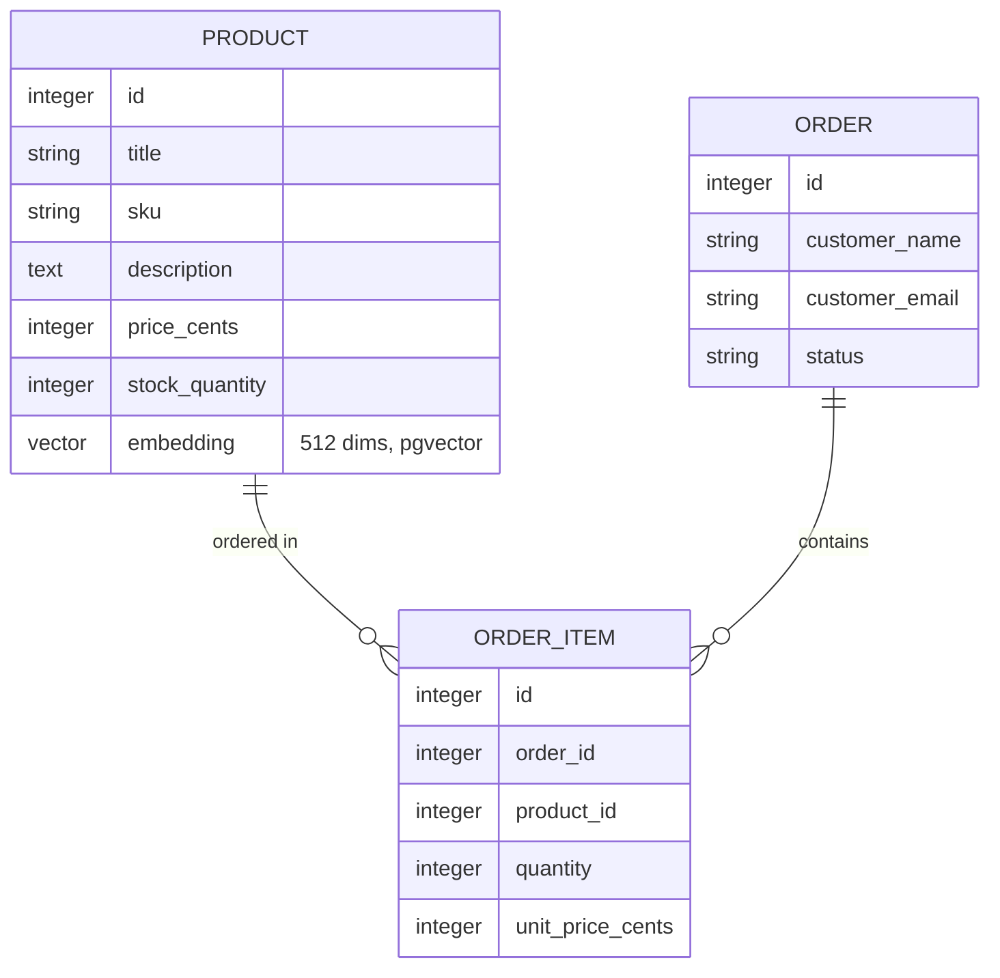

<h1 align="center">
  
</h1>

<p align="center"><strong>Learn how to build an MCP server in Ruby on Rails that gives an AI assistant real access to a store.</strong></p>

<p align="center">
  <a href="https://github.com/mjesar/shop_mcp_server/actions/workflows/ci.yml"></a>
  
  
  
  
  
</p>

**Shop MCP Server is a Ruby on Rails MCP (Model Context Protocol) server that lets an AI assistant such as Claude read a small store's products, orders and inventory, place orders, and search products by meaning.** It is for Rails developers who want to see how an MCP server and a small RAG (retrieval-augmented generation) feature work in a real app.

It is built on the [official `mcp` Ruby SDK](https://github.com/modelcontextprotocol/ruby-sdk), PostgreSQL with [pgvector](https://github.com/pgvector/pgvector), and [Voyage AI](https://www.voyageai.com/) embeddings.

## Why this exists

An AI assistant can only talk. It cannot check your database, place an order or know what is really in stock. Left alone, it guesses, and a guess that sounds right is worse than no answer.

MCP fixes that by giving the assistant a toolbox. Each tool is one clearly labeled capability, and the assistant reads the labels and decides on its own when to use one. Nobody hardcodes "when the user asks about stock, call this."

This is a learning project, and the most useful thing it taught me is that **the docs and the tutorials are not the source of truth, running code is.** Two real examples:

- I first built this with the community `fast-mcp` gem. Claude's custom connector setup kept failing and reported an authentication problem. It was not one. `fast-mcp` only speaks the older SSE transport, Claude probes with Streamable HTTP, and the probe hit a `GET`-only route and got a 405. I rewrote everything on the official gem. [The full story](#what-keeps-it-reliable) is below.
- The `mcp` gem's own docs show prompt arguments with string keys. At runtime they arrive as symbols. I found that by adding a debug log line, and a spec now guards against someone "fixing" it back.

## See it work

<p align="center">
  
</p>

<details>
<summary>Text version of the diagram</summary>

An MCP client (Claude, MCP Inspector or curl) sends JSON-RPC 2.0 messages over HTTP, with an `Mcp-Session-Id` header, to one endpoint, `/mcp`. That endpoint is a `StreamableHTTPTransport` mounted in `config/routes.rb`. The transport hands each message to a single `MCP::Server`, which holds the registry of tools, resources and prompts and the session state.

Tools (`app/tools/*.rb`) query the database through plain ActiveRecord models (`Product`, `Order`, `OrderItem`), stored in PostgreSQL with the pgvector extension. Resources (`app/resources/*.rb`) read the same models. The semantic search tool also calls `VoyageClient` (`app/services/voyage_client.rb`), which sends an HTTPS POST to the Voyage AI embeddings API before it queries Postgres.

</details>

<!-- Paste the demo video's user-attachments URL on its own line below to embed it (drag the MP4 into GitHub's web editor to get one). -->

<!-- Replace this note with a real transcript of one "something warm for winter" search once I have captured it. -->

What the server exposes today, counted from [`config/routes.rb`](config/routes.rb) and the seed file:

| Piece | Count | Examples |
|---|---|---|
| Tools | 7 | `get_product_tool`, `create_order_tool`, `semantic_search_products_tool` |
| Resources | 2 | `shop://products/catalog`, `shop://products/low-stock` |
| Prompts | 1 | `inventory_check` |
| Seeded products | 10 | Merino Wool Scarf, Cotton Knit Beanie, Hiking Backpack 40L |

In my own hand testing, a search for "something warm for winter" surfaced the scarf and the beanie even though neither word appears in their descriptions. That is a hand-run check, not a measured benchmark, and the repo has no specs for semantic search yet (see [Status](#status)).

## How it works

A normal chat reply is `Question → Answer`. With MCP it becomes `Question → pick a tool → real data → Answer`. When someone asks an assistant *"what's running low on stock?"*:

1. **The client lists the tools.** It sends `tools/list` and the server returns every tool with its description. The registry is the `tools:` array in [`config/routes.rb`](config/routes.rb).
2. **The AI picks one.** It reads the descriptions and decides [`CheckInventoryTool`](app/tools/check_inventory_tool.rb) matches. The tool's own description says it flags "every product at or below a low-stock threshold."
3. **The client calls it.** It sends `tools/call` with arguments, for example `threshold: 5`. The default threshold is 5.
4. **Rails runs real code.** The tool's `call` method is plain ActiveRecord against PostgreSQL, much like a controller action.
5. **The AI writes the answer** from the real numbers instead of guessing.

The protocol work (sessions, JSON-RPC framing, schemas) belongs to the gem. The app's own code is ordinary Ruby underneath it.

### Tools

| Tool | Type | What it does |
|---|---|---|
| `get_product_tool` | read-only | Full detail for one product, by ID or SKU |
| `list_products_tool` | read-only | Search or browse the catalog, optionally in-stock only |
| `check_inventory_tool` | read-only | Flags every product at or below a stock threshold (default 5) |
| `list_orders_tool` | read-only | Recent orders, optionally filtered by status |
| `get_order_tool` | read-only | Full order detail including line items |
| `create_order_tool` | **write** | Places an order and decrements stock, annotated `destructive_hint: true` |
| `semantic_search_products_tool` | read-only | Finds products by meaning using Voyage embeddings and pgvector cosine similarity |

Every tool declares [MCP annotations](https://ruby.sdk.modelcontextprotocol.io/server/tools/) (`read_only_hint`, `destructive_hint`, `idempotent_hint`, `open_world_hint`). A compliant client uses them to decide what is safe to run automatically and what needs the user's OK. In Claude the six read-only tools are grouped apart from `create_order_tool`, which is flagged for approval.

`create_order_tool` wraps its work in one `ActiveRecord::Base.transaction`. If any line item fails (unknown SKU, not enough stock), the whole order and every stock decrement is rolled back. [`spec/tools/create_order_tool_spec.rb`](spec/tools/create_order_tool_spec.rb) covers this.

### Resources and prompts

| Resource | URI | Content |
|---|---|---|
| Product Catalog | `shop://products/catalog` | Full catalog as JSON |
| Low Stock Products | `shop://products/low-stock` | Products at or below 5 units |

| Prompt | Argument | What it does |
|---|---|---|
| `inventory_check` | `threshold` (optional) | Hands the client a ready-made question: what is at or below N units, and what should I reorder? |

A resource is data a client reads directly, like opening a file. A prompt is a saved template that phrases a good question, which the client's model then answers, likely by calling `check_inventory_tool`. Tools, resources and prompts are the three building blocks MCP defines, and this project uses all three.

### Semantic search (RAG)

Exact-match search fails when people describe what they want instead of naming it. `semantic_search_products_tool` finds products by meaning:

1. **Embed the products.** Each product's title and description go to Voyage AI (`voyage-3.5-lite`, 512 dimensions) through [`VoyageClient`](app/services/voyage_client.rb), a small `Net::HTTP` wrapper with no extra HTTP gem.
2. **Store the vectors.** The 512 numbers go into a `vector(512)` column on `products`, using pgvector and the [`neighbor`](https://github.com/ankane/neighbor) gem (`has_neighbors :embedding`).
3. **Embed the query the same way**, then ask Postgres for the closest stored vectors with `Product.nearest_neighbors(:embedding, query_vector, distance: "cosine")`. This step is plain geometry, with no AI involved.
4. **Return the matches** to the calling client, which writes the answer. This app only does the "retrieval" half of RAG and never generates text itself.

Backfill embeddings for existing products with `bin/rails embeddings:backfill`. It only embeds products where `embedding` is `nil`, and it sends them all in **one batched API call**. Voyage's free tier can be as low as 3 requests per minute, so batching is a requirement, not an optimization.

I use Voyage because [Anthropic's docs say Anthropic offers no embedding model of its own](https://platform.claude.com/docs/en/build-with-claude/embeddings) and recommend Voyage AI as the partner for Claude-based RAG.

### Data model

Money is stored as integer cents (`price_cents`, `unit_price_cents`) to avoid floating-point rounding. `unit_price_cents` is copied onto `OrderItem` at order time, so an order keeps showing what the customer actually paid even if the product price changes later.

<details>
<summary>Entity diagram (text version below)</summary>


```mermaid
erDiagram
    PRODUCT ||--o{ ORDER_ITEM : "ordered in"
    ORDER ||--o{ ORDER_ITEM : contains

    PRODUCT {
        integer id
        string title
        string sku
        text description
        integer price_cents
        integer stock_quantity
        vector embedding "512 dims, pgvector"
    }
    ORDER {
        integer id
        string customer_name
        string customer_email
        string status
    }
    ORDER_ITEM {
        integer id
        integer order_id
        integer product_id
        integer quantity
        integer unit_price_cents
    }
```

Text version: a `Product` (id, title, sku, description, price_cents, stock_quantity, a 512-dimension embedding) can appear in many `OrderItem` rows. An `Order` (id, customer_name, customer_email, status) has many `OrderItem` rows. An `OrderItem` (id, order_id, product_id, quantity, unit_price_cents) links one order to one product.

</details>

## Quick start

You need Ruby (this project runs on 4.0.4), Bundler, and PostgreSQL with the pgvector extension installed (on Ubuntu the package is named like `postgresql-16-pgvector`, matching your Postgres version).

```bash
git clone https://github.com/mjesar/shop_mcp_server.git
cd shop_mcp_server
bundle install
cp .env.example .env            # then fill in VOYAGE_API_KEY
bin/rails db:create db:migrate db:seed
bin/rails embeddings:backfill   # needed for semantic search only
bin/rails server
```

The seed step prints:

```
Seeded 10 products.
```

The MCP server is now live at `http://localhost:3000/mcp`. Check it by hand with the real protocol (Streamable HTTP is session-based, so there are three steps):

```bash
# 1. Initialize. The response carries an Mcp-Session-Id header.
curl -s -D - -o /dev/null http://localhost:3000/mcp \
  -H "Accept: application/json, text/event-stream" \
  --json '{"jsonrpc":"2.0","id":1,"method":"initialize","params":{"protocolVersion":"2025-11-25","capabilities":{},"clientInfo":{"name":"curl","version":"1.0"}}}'

# 2. Acknowledge. This is a notification (no id), so the server answers 202 with no body.
SESSION_ID=<paste the Mcp-Session-Id header value>
curl -s http://localhost:3000/mcp \
  -H "Accept: application/json, text/event-stream" \
  -H "Mcp-Session-Id: $SESSION_ID" \
  --json '{"jsonrpc":"2.0","method":"notifications/initialized"}'

# 3. Call a tool.
curl -s http://localhost:3000/mcp \
  -H "Accept: application/json, text/event-stream" \
  -H "Mcp-Session-Id: $SESSION_ID" \
  --json '{"jsonrpc":"2.0","id":2,"method":"tools/call","params":{"name":"list_products_tool","arguments":{"in_stock_only":true}}}'
```

Other ways to try it:

- **Straight from Ruby**, which is cheapest and skips the protocol: `bin/rails runner 'pp GetProductTool.call(sku: "SCF-001", server_context: {})'`. This does not prove argument validation works, so use curl for that.
- **MCP Inspector**: run `npx @modelcontextprotocol/inspector`, add a server with transport **Streamable HTTP** and URL `http://localhost:3000/mcp`.
- **Claude as a real client**: Claude connects from Anthropic's cloud, so `localhost` will not work. Expose the server first (for example `ngrok http 3000`), set `NGROK_HOST` in `.env`, then add a custom connector pointing at `https://<your-tunnel-url>/mcp`.

## Key terms

- **MCP (Model Context Protocol)**: an open protocol that lets an AI client discover and call tools, read resources and use prompts on a server, so the model can work with real data instead of guessing.
- **MCP server**: a program that exposes tools, resources and prompts over MCP. This repo is one, written in Ruby on Rails.
- **Tool**: one capability the AI can call, with a name, a description it reads, and an input schema. Example: `check_inventory_tool`.
- **Resource**: read-only data a client can open directly, like a file. Example: `shop://products/catalog`.
- **Prompt**: a saved, reusable question template a user can invoke.
- **Streamable HTTP**: the MCP transport that uses a single endpoint for both directions. Claude's custom connectors expect it.
- **JSON-RPC 2.0**: the message format MCP uses. A message with an `id` is a request that expects a reply. A message without one is a notification.
- **Embedding**: a list of numbers (here, 512) that represents the meaning of a piece of text, so similar meanings land close together.
- **pgvector**: a PostgreSQL extension that stores embeddings and finds the nearest ones.
- **RAG (retrieval-augmented generation)**: fetching relevant data first, then letting a model write its answer from it. This app does the retrieval half.

## Project structure

Most of the code is plain Ruby classes under `app/`. It is a Rails app mainly for autoloading, ActiveRecord, config and the test setup. The generated web and job folders (`app/controllers`, `app/views`, `app/jobs`, `app/mailers`, and `.kamal/`, `Dockerfile`) are framework boilerplate you can ignore.

```
shop_mcp_server/
├── app/
│   ├── tools/                       <-- the 7 MCP tools, one file each
│   ├── resources/                   <-- the 2 MCP resources
│   ├── prompts/
│   │   └── inventory_check_prompt.rb  <-- the one saved prompt
│   ├── models/                      <-- Product, Order, OrderItem
│   └── services/
│       └── voyage_client.rb         <-- Net::HTTP client for Voyage embeddings
├── config/
│   └── routes.rb                    <-- builds the MCP::Server and mounts it at /mcp
├── db/
│   ├── migrate/                     <-- tables, then the pgvector extension and embedding column
│   └── seeds.rb                     <-- the 10 sample products
├── lib/tasks/embeddings.rake        <-- bin/rails embeddings:backfill
├── spec/                            <-- RSpec: tools, resources, prompt, models
├── docs/mcp-concepts.md             <-- notes on what I verified while building
└── assets/readme/hero.svg           <-- the banner at the top of this README
```

Inside `app/tools/`:

| File | What it does |
|---|---|
| `get_product_tool.rb` | One product by ID or SKU |
| `list_products_tool.rb` | Browse or search the catalog |
| `check_inventory_tool.rb` | Products at or below a stock threshold |
| `list_orders_tool.rb`, `get_order_tool.rb` | Read orders and their line items |
| `create_order_tool.rb` | The only write tool, in one transaction |
| `semantic_search_products_tool.rb` | Embeds the query, then runs the pgvector nearest-neighbor search |

## What keeps it reliable

- **Specs.** RSpec covers all six non-search tools, both resources, the prompt and the models, calling each tool's `call` directly. There is a CI workflow, [`.github/workflows/ci.yml`](.github/workflows/ci.yml), that runs Brakeman, bundler-audit, RuboCop and the specs.
- **Transactions.** `create_order_tool` rolls back everything if any line fails, and a spec proves the order count and stock levels stay unchanged.
- **Annotations.** Read-only versus write tools are declared, so clients can ask for approval before anything destructive.
- **The real protocol, by hand.** I checked behavior with curl and MCP Inspector, not just unit tests, because that is where the bug below showed up.

**One real failure, and its fix.** Connecting Claude to my first version failed, and Claude reported an authentication problem. I spent time on auth before checking the actual traffic. The cause was transport. `fast-mcp` only implements the legacy SSE transport, which uses a long-lived `GET` plus a separate `POST` endpoint. Claude's connector setup assumes Streamable HTTP, a single endpoint, so its `POST` landed on a `GET`-only route and got a 405, which the setup flow misreported as an auth error. `fast-mcp`'s GitHub issues #166 and #168 describe the same limitation. The fix was to move every tool and both resources to the official `mcp` gem, which implements Streamable HTTP natively. Notes on what changed are in [`docs/mcp-concepts.md`](docs/mcp-concepts.md).

That fix came with a trade-off. The gem offers two Rails patterns. **Mount** (what I use) builds one server at boot with full session lifecycle, but needs `config.enable_reloading = false`, so code changes need a restart. **Controller** builds a stateless server per request and keeps normal Rails reloading. I picked mount on purpose, to learn the fuller session architecture.

## Learn more

- [`docs/mcp-concepts.md`](docs/mcp-concepts.md): the running log of what I verified while building, including requests versus notifications, the three-step handshake, a tool's three names (`name`, `title`, `description`), and the symbol-versus-string prompt argument discrepancy
- [Official `mcp` Ruby SDK](https://github.com/modelcontextprotocol/ruby-sdk) and the [MCP specification](https://modelcontextprotocol.io/)
- [pgvector](https://github.com/pgvector/pgvector) and the [`neighbor`](https://github.com/ankane/neighbor) gem

### FAQ

#### How do I build an MCP server in Ruby on Rails?
Add the official `mcp` gem, define each tool as a class that inherits from `MCP::Tool` with an `input_schema` and a class-level `call` method, then build one `MCP::Server` in `config/routes.rb` and mount a `StreamableHTTPTransport` at `/mcp`. [`config/routes.rb`](config/routes.rb) and [`app/tools/`](app/tools/) show the whole thing.

#### Which Ruby gem should I use for MCP?
This project uses the official `mcp` gem from `modelcontextprotocol`. It is a different project from `fast-mcp` (by `yjacquin`) and from FastMCP, a Python framework, even though the names are close. I moved off `fast-mcp` because it only supports the legacy SSE transport.

#### Why does Claude say my MCP server has an authentication problem?
It may not be authentication. If your server only supports the legacy SSE transport, Claude's Streamable HTTP probe can get a 405 and be reported as an auth failure. That is what happened here, so check the transport first.

#### How do I connect a local MCP server to Claude?
Claude connects from Anthropic's cloud, so `localhost` does not work. Tunnel the server (for example with `ngrok http 3000`), set `NGROK_HOST`, and add a custom connector pointing at `https://<your-tunnel-url>/mcp`.

#### How do I add semantic search to a Rails app?
Embed your text with an embeddings API, store the vector in a pgvector column, and query it with the `neighbor` gem. The steps and code are in [Semantic search (RAG)](#semantic-search-rag) above.

#### Does this work with multiple Puma workers?
No. The gem keeps session state in a plain in-memory Ruby `Hash`, so it must run as a single process. See [Status](#status).

## Setup

Requires Ruby (this project runs on 4.0.4), Bundler, and PostgreSQL with the pgvector extension.

- `VOYAGE_API_KEY`: needed for embeddings and semantic search. See [`.env.example`](.env.example). A key created through MongoDB Atlas's "Model API Key" flow authenticates against `ai.mongodb.com`, not `api.voyageai.com`, and `VoyageClient::ENDPOINT` is set for that Atlas-issued path.
- `NGROK_HOST`: optional, the full tunnel URL (for example `https://abc.ngrok-free.app`) when connecting Claude through a tunnel. The gem's DNS-rebinding protection (`allowed_hosts`, `allowed_origins`) matches **exact strings**, not regular expressions. `allowed_hosts` needs a bare hostname and `allowed_origins` needs scheme plus host, so [`config/routes.rb`](config/routes.rb) derives one from the other.

The project began on SQLite and moved to PostgreSQL because pgvector has no SQLite equivalent for this gem stack. If you do not need semantic search, the other six tools do not depend on pgvector.

## Tech stack

- Ruby 4.0.4 and Rails 8.1.3.1
- [`mcp`](https://github.com/modelcontextprotocol/ruby-sdk) 1.5.1, the official Ruby SDK
- PostgreSQL with pgvector, via the [`neighbor`](https://github.com/ankane/neighbor) gem 1.2.0
- [Voyage AI](https://www.voyageai.com/) `voyage-3.5-lite`, 512-dimension embeddings
- RSpec (`rspec-rails` 8.0.4)

## Status

A working learning project, not production software. It is not a full store backend and it has no authentication.

Known limitations:

- **Sessions are in memory and single-process.** `StreamableHTTPTransport` stores sessions in a plain Hash with no pluggable store, so even multiple Puma workers break it, and a restart drops every session. The official Python and TypeScript SDKs share this design, and the newest MCP spec revision (2026-07-28) moves toward a stateless model to fix it.
- **No authentication.** Every caller is treated the same. Fine locally, not for a real deployment.
- **No live push.** `resources/subscribe` is not wired up, so a client re-reads a resource to see fresh data.
- **Type-only schema validation.** `input_schema` is plain JSON Schema, so tools guard against missing or bad input themselves.
- **Semantic search has no specs.** It has only been checked by hand.
- **Embeddings are not kept in sync.** Editing a product does not re-embed it, because the backfill task only fills rows where `embedding` is `nil`. A production version would re-embed in an `after_commit` callback.
- **Voyage's default data-use terms are opt-out.** Text sent to the API may be used to improve their models unless you opt out in their dashboard. Check this before sending anything sensitive.

Not built here, in case you want to extend it: resource subscriptions, sampling, elicitation, OAuth-based authorization, and automatic re-embedding.

## Related work

This is one of three connected projects on agentic commerce:

- [`product_geo_agent`](https://github.com/mjesar/product_geo_agent): a Rails CLI agent that scores how discoverable a Shopify product is to AI assistants (agents and tool calling).
- [`ai_shop_assistant`](https://github.com/mjesar/ai_shop_assistant): a shopping chat assistant that calls Shopify's live Catalog API over MCP (the client side of what this repo serves).
- [`ucp_catalog`](https://github.com/mjesar/ucp_catalog): a Ruby gem in development for talking to Universal Commerce Protocol catalog APIs.
